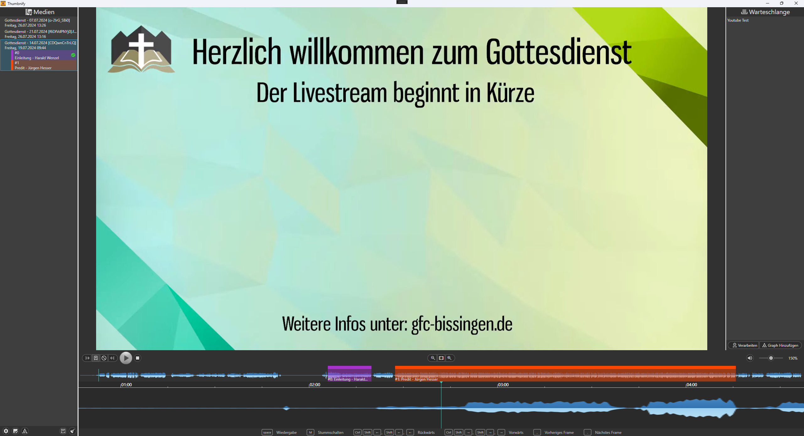
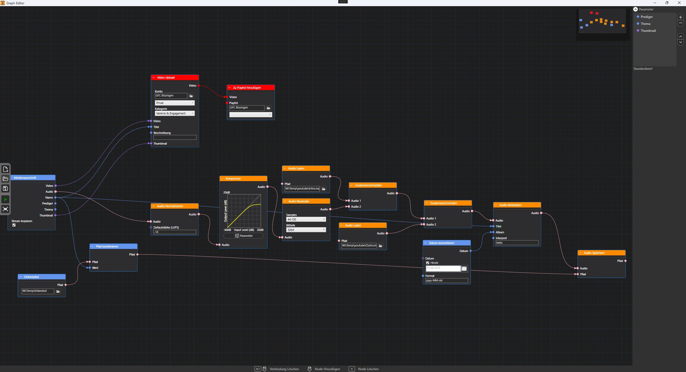
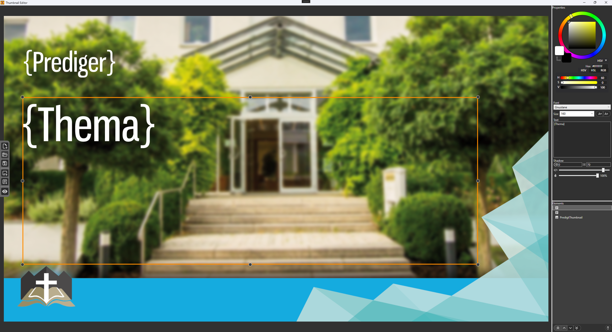

# Thumbnify

Thumbnify is a tool to easily execute repeated tasks on a recording or parts of a recording, like Uploading, extracting Audio, Normalizing etc.

It allows you to select parts of a recording and execute customized actions on those parts.

It can also generate Thumbnails for your Videos.

For a detailed How to use, head to the wiki.